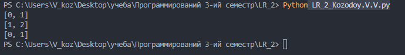

# Лабораторная работа №2

## Посстановка задачи

Напишите функцию `add`, которая будет принимать два аргумента: `nums` – массив целых чисел и `target` – целое число; и возвращать в любом порядке индексы двух элементов массива `nums`, в сумме дающих `target`. У каждого входного набора может не быть решений или может быть только одно решение, если есть элементы дающие в сумме `target`. Для вычисления `target` нельзя использовать один и тот же элемент массива `nums` дважды.

Удостоверьтесь, что решение проходит следующие тесты:

Тест 1:

Input: nums = [2,7,11,15], target = 9

Output: [0,1]

Тест 2:

Input: nums = [3,2,4], target = 6

Output: [1,2]

Тест 3:

Input: nums = [3,3], target = 6

Output: [0,1] 

## Код

```Python

def add(nums, target):
    seen = {}
    i = 0
    while i < len(nums):
        num = nums[i]
        complement = target - num
        if complement in seen:
            return [seen[complement], i]
        seen[num] = i
        i = i + 1
    return []


print(add([2, 7, 11, 15], 9))
print(add([3, 2, 4], 6))
print(add([3, 3], 6))

```

## Тесты


